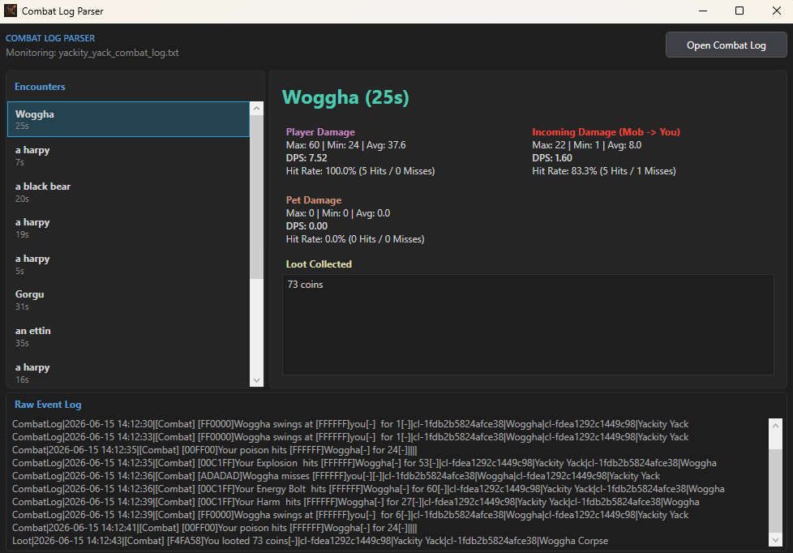

# Shards of Britannia Combat Log Reader

[](https://github.com/crowface28/SobLogReader/actions/workflows/build.yml)

<p align="center">
  
</p>

A real-time combat log parser and metrics reader for **Shards of Britannia**. It parses raw combat log files generated by the game client and produces dynamic, real-time statistics for encounters.

<p align="center">
  
</p>

---

## 🚀 Quick Start (Easy Setup)

If you just want to run the tool without dealing with technical commands or code:

1. Open your browser and go to the **[Releases](https://github.com/crowface28/SobLogReader/releases)** page on GitHub.
2. Under the latest version, click on **`SobLogReader.exe`** to download it.
3. Save it anywhere on your computer (like your Desktop or Downloads folder).
4. Double-click the downloaded **`SobLogReader.exe`** file to start!
   * *Note: If Windows SmartScreen displays a warning, click **"More Info"** and then **"Run anyway"**.*

---

## Features

- **Real-Time Log Polling**: Automatically polls the selected active log file for updates as they happen.
- **Encounter Tracking**: Groups combat events into logical individual encounters (Fights) sorted chronologically.
- **Detailed Damage Metrics**:
  - **Player metrics**: Total damage, max/min/avg hit size, DPS, and overall hit rate (hits vs misses).
  - **Mob metrics**: Incoming damage details (max/min/avg, incoming DPS, and hit rates).
  - **Pet metrics**: Isolated logs and statistics tracking your pet's damage and accuracy.
- **Loot Summary**: Parses and displays a clean list of all items looted during each encounter.
- **Raw Event Logs**: View the exact raw text lines of the combat events for each fight.

---

## 🛠️ How to Build from Source (Step-by-Step)
 
If you want to compile the code yourself instead of downloading the pre-built release:
 
### 1. Download & Extract the Code
1. Click the green **Code** button at the top right of this GitHub repository page.
2. Select **Download ZIP** from the menu.
3. Once downloaded, extract the contents of the ZIP file to a folder on your computer (for example, on your Desktop).
 
### 2. Install the Prerequisites
Make sure you have the [.NET SDK 10.0](https://dotnet.microsoft.com/en-us/download) installed on your computer.
 
### 3. Open a Command Prompt in the Folder
1. Open the folder where you extracted the source files.
2. Click on the address bar at the top of the folder window (where it shows the folder path).
3. Type `cmd` and press **Enter**. A black command prompt window will open automatically focused on that directory.
 
### 4. Compile the Executable
In the command prompt window, type the following command and press **Enter**:
```cmd
dotnet publish -c Release
```
 
### 5. Find the Built Application
Once the build completes successfully, your single-file executable is ready. You can find it at this location inside your folder:
`bin\Release\net10.0-windows\win-x64\publish\SobLogReader.exe`

---

## Opening in Visual Studio

You can open the workspace directly in Visual Studio using the provided `.slnx` solution file, where you can build, run, and debug using the standard visual tools.
